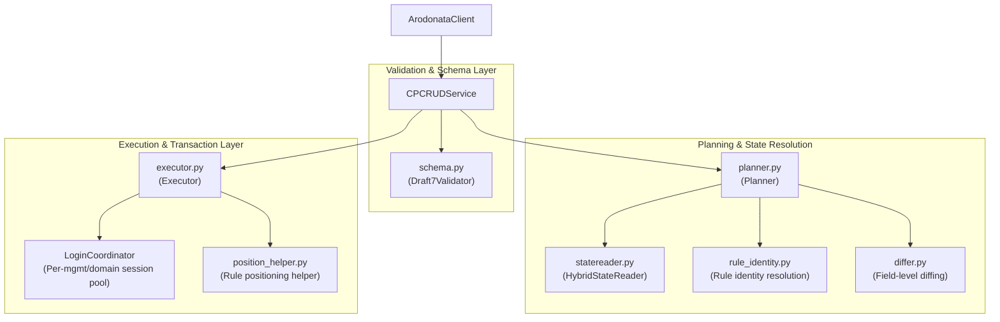
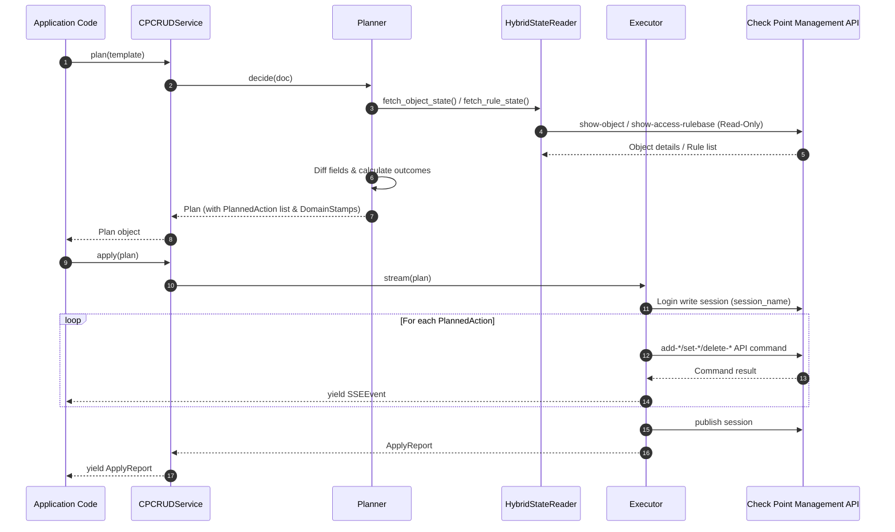

# Architecture: CPCRUD Engine

The **CPCRUD** (Check Point Policy-as-Code CRUD) engine is designed around a **Plan-then-Execute** architecture with strict separation of concerns between schema validation, live state resolution, conflict evaluation, action planning, and transactional execution.

---

## Architectural Component Overview

---

## Component Roles & Responsibilities

### 1. `CPCRUDService` (`src/arodonata/cpcrud/service.py`)

The public facade attached to `ArodonataClient.cpcrud`. Orchestrates `validate()`, `plan()`, and `apply()`. Exposes an `AsyncIterator[SSEEvent | ApplyReport]` interface for streamable execution logging.

### 2. Schema Layer (`src/arodonata/cpcrud/schema.py`)

Uses `jsonschema.Draft7Validator` against `checkpoint_ops_schema.json` to enforce strict syntax validation for incoming templates before any network calls are made.

### 3. `HybridStateReader` (`src/arodonata/cpcrud/statereader.py`)

Queries live management state via `ArodonataClient` read operations (or DB cache) to build `ObjectState` representations. It reads existing object fields, meta-info locks, and rulebase trees without modifying live session state.

### 4. `Planner` (`src/arodonata/cpcrud/planner.py`)

Core decision engine. Transforms normalized template operations into a deterministic `Plan` containing a list of `PlannedAction` items.

- Evaluates `NameConflictPolicy` (`UPDATE` | `ERROR`) and `IpConflictPolicy` (`REUSE` | `CREATE_NEW` | `ERROR`).
- Calculates field diffs via `differ.py`.
- Determines the exact outcome (`CREATE`, `UPDATE`, `REUSE`, `UNCHANGED`, `DELETE`, `CONFLICT`).
- Generates `DomainStamp` records for each target domain to track `last_publish_session` hashes.

### 5. `Executor` (`src/arodonata/cpcrud/executor.py`)

Performs live write operations.

- Obtains dedicated write sessions per `(mgmt_name, domain_name)` via `LoginCoordinator.acquire_write_session()`.
- Validates that domain session stamps have not drifted (`PLAN_STALE` check).
- Executes low-level API commands (`add-host`, `set-network`, `add-access-rule`, etc.).
- Publishes or discards write sessions atomically upon completion.

---

## Plan-then-Execute Sequence

The execution sequence ensures that no write actions take place until a complete plan has been computed and verified.

---

## Conflict & Drift Detection Architecture

### Domain Stamps & Stale Plan Safeguard

When a `Plan` is created, `Planner` records a `DomainStamp` for each target domain containing the `last_publish_session` UID.

During `apply()`, `Executor` re-checks the target domain's published session UID. If another administrator or script published changes in that domain while the plan was sitting unexecuted, `Executor` aborts execution with `PLAN_STALE` to prevent unintended policy overwrites.

### Field Diffing (`differ.py`)

When an object exists, `differ.py` compares the normalized desired attributes against `ObjectState.raw`.

- If no fields differ, the action outcome is set to `Outcome.UNCHANGED` and no API write is executed.
- If fields differ, the action outcome is set to `Outcome.UPDATE` with an explicit `changes` payload detailing old vs new values.

---

## Rule Positioning & Identity Resolution

Access and NAT rules in Check Point do not always have unique global names. `rule_identity.py` and `position_helper.py` handle rule identity and positional anchoring:

1. **Rule Matching (`RuleMatch`)**: Matches rules based on rule names, rule numbers, or signature match (source, destination, service, action).
2. **Positional Target**: `position_helper.py` converts abstract positioning options (`top`, `bottom`, `above`, `below`) into concrete Check Point API `position` structures required during rule creation or reordering.
