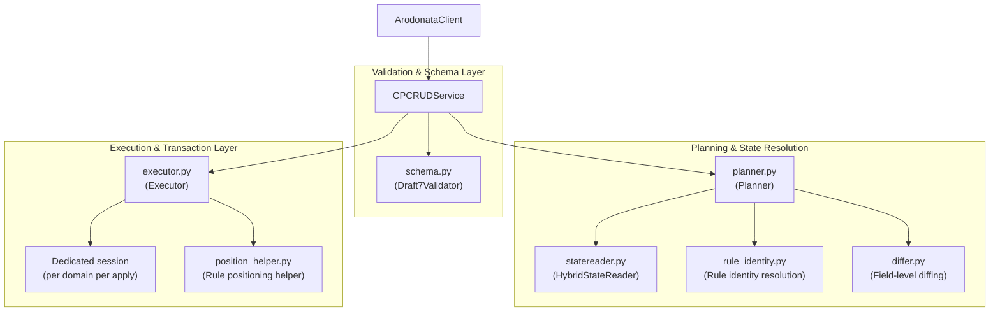
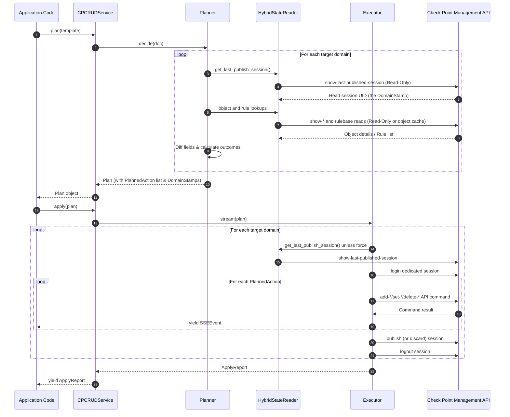

# Architecture: CPCRUD Engine

The **CPCRUD** (Check Point Policy-as-Code CRUD) engine is designed around a **Plan-then-Execute** architecture with strict separation of concerns between schema validation, live state resolution, conflict evaluation, action planning, and transactional execution.

---

## Architectural Component Overview

```mermaid
graph TD
    Client["ArodonataClient"] --> Service["CPCRUDService"]
    
    subgraph "Validation & Schema Layer"
        Service --> Schema["schema.py\n(Draft7Validator)"]
    end
    
    subgraph "Planning & State Resolution"
        Service --> Planner["planner.py\n(Planner)"]
        Planner --> StateReader["statereader.py\n(HybridStateReader)"]
        Planner --> RuleIdentity["rule_identity.py\n(Rule identity resolution)"]
        Planner --> Differ["differ.py\n(Field-level diffing)"]
    end
    
    subgraph "Execution & Transaction Layer"
        Service --> Executor["executor.py\n(Executor)"]
        Executor --> Session["Dedicated session\n(per domain per apply)"]
        Executor --> PositionHelper["position_helper.py\n(Rule positioning helper)"]
    end
```

---

## Component Roles & Responsibilities

### 1. `CPCRUDService` (`src/arodonata/cpcrud/service.py`)

The public facade attached to `ArodonataClient.cpcrud`. Orchestrates `validate()`, `plan()`, and `apply()`. Exposes an `AsyncIterator[SSEEvent | ApplyReport]` interface for streamable execution logging.

### 2. Schema Layer (`src/arodonata/cpcrud/schema.py`)

Uses `jsonschema.Draft7Validator` against `checkpoint_ops_schema.json` to enforce strict syntax validation for incoming templates before any network calls are made.

### 3. `HybridStateReader` (`src/arodonata/cpcrud/statereader.py`)

Queries live management state via `ArodonataClient` read operations, or the object cache for hosts, networks, address ranges and groups while the cache's freshness stamp equals the domain's current head, to build `ObjectState` representations. It reads existing object fields, meta-info locks, and rulebase trees without modifying live session state.

### 4. `Planner` (`src/arodonata/cpcrud/planner.py`)

Core decision engine. Transforms normalized template operations into a deterministic `Plan` containing a list of `PlannedAction` items.

- Evaluates `NameConflictPolicy` (`UPDATE` | `ERROR`) and `IpConflictPolicy` (`REUSE` | `CREATE_NEW` | `ERROR`).
- Calculates field diffs via `differ.py`.
- Determines the exact plan-time outcome (`CREATE`, `UPDATE`, `REUSE`, `UNCHANGED`, `DELETE`, `CONFLICT`, `ERROR`); apply adds `LOCKED`, `DRIFTED`, `SKIPPED_DEPENDENCY` and `PLAN_STALE`.
- Records a `DomainStamp` per target domain holding its `last_publish_session` UID (the domain's head session, read before its lookups); a domain whose head cannot be read gets no stamp and its operations become `ERROR`.

### 5. `Executor` (`src/arodonata/cpcrud/executor.py`)

Performs live write operations.

- Opens one dedicated write session per `(mgmt_name, domain_name)` for each apply via `ArodonataClient.create_dedicated_session()` and logs it out (`logout_sid`) when that domain is done, whether it published, discarded or failed.
- Validates that domain session stamps have not drifted (`PLAN_STALE` check).
- Executes low-level API commands (`add-host`, `set-network`, `add-access-rule`, etc.).
- Publishes or discards write sessions atomically upon completion.

---

## Plan-then-Execute Sequence

The execution sequence ensures that no write actions take place until a complete plan has been computed and verified.

```mermaid
sequenceDiagram
    autonumber
    participant App as Application Code
    participant Service as CPCRUDService
    participant Planner as Planner
    participant StateReader as HybridStateReader
    participant Executor as Executor
    participant Mgmt as Check Point Management API

    App->>Service: plan(template)
    Service->>Planner: decide(doc)
    loop For each target domain
        Planner->>StateReader: get_last_publish_session()
        StateReader->>Mgmt: show-last-published-session (Read-Only)
        Mgmt-->>StateReader: Head session UID (the DomainStamp)
        Planner->>StateReader: object and rule lookups
        StateReader->>Mgmt: show-* and rulebase reads (Read-Only or object cache)
        Mgmt-->>StateReader: Object details / Rule list
        Planner->>Planner: Diff fields & calculate outcomes
    end
    Planner-->>Service: Plan (with PlannedAction list & DomainStamps)
    Service-->>App: Plan object

    App->>Service: apply(plan)
    Service->>Executor: stream(plan)
    loop For each target domain
        Executor->>StateReader: get_last_publish_session() unless force
        StateReader->>Mgmt: show-last-published-session
        Executor->>Mgmt: login dedicated session
        loop For each PlannedAction
            Executor->>Mgmt: add-*/set-*/delete-* API command
            Mgmt-->>Executor: Command result
            Executor-->>App: yield SSEEvent
        end
        Executor->>Mgmt: publish (or discard) session
        Executor->>Mgmt: logout session
    end
    Executor-->>Service: ApplyReport
    Service-->>App: yield ApplyReport
```

The planner's lookups are `get_by_name`, `find_by_ip`, `get_rule_by_key`, `find_rules_by_traffic` and their siblings on the `StateReader`. At apply, a domain whose head is not its stamp (or cannot be read) is `PLAN_STALE` and nothing is written there; otherwise the executor opens a dedicated session with `ArodonataClient.create_dedicated_session`.

---

## Conflict & Drift Detection Architecture

### Domain Stamps & Stale Plan Safeguard

When a `Plan` is created, `Planner` records a `DomainStamp` for each target domain containing the `last_publish_session` UID. It reads the stamp before the domain's lookups, so a publish while the domain is being planned leaves the plan stale instead of being stamped as already seen.

During `apply()`, `Executor` re-checks the target domain's published session UID. If another administrator or script published changes in that domain while the plan was sitting unexecuted, `Executor` aborts execution with `PLAN_STALE` to prevent unintended policy overwrites.

The stamps are read with `ArodonataClient.fetch_last_published_session`, which never stores them: the stored last-published session is the object cache's freshness stamp, and storing cpcrud's reads marked the cache fresh without refreshing it, so cpcrud's own changes (and a publish before the plan) did not reach the cache until a full refresh. After cpcrud publishes, `invalidate_domain` makes the next smart read through the client (`CacheRefreshCoordinator`) compare the stored stamp with the new head and refresh the domain. cpcrud's own cache-first lookups (`HybridStateReader`) do not refresh the cache: they use it for a domain only while its stored stamp is the head the planner just read for that domain, and otherwise look every object up live, so a row from before the last publish (an object deleted or changed since) is never trusted. Each `plan()` and each `apply()` gets its own reader, so the head one run read never decides a cache lookup of another (two concurrent plans of a domain, or an apply with `force` that reads no head).

A head that cannot be read (including a failed or timed-out `show-last-published-session`, which `fetch_last_published_session` logs and reports as no record) never reads as "no stamp": at plan time every operation of that domain becomes an `ERROR` that writes nothing and no lookup runs for it (a plan without a stamp cannot be checked for staleness; template errors in those operations, such as a missing layer, surface on the next plan), and at apply time the domain is `PLAN_STALE` ("could not read the domain's last published session …; re-plan or use force"); `force` skips the check as before. The stamp recorded after cpcrud's own publish is only reported, and is empty if it cannot be read.

### Failed Lookups

A lookup that decides whether something already exists never reads a failed call as "not found": the name lookup (`show-<type>`, except Check Point's own "object not found"), the IP lookup (`show-objects`), the service port listing (`show-services-tcp`/`-udp`), every rulebase read (each page of `show-*-rulebase`) and `where-used` raise `StateReadError` when the call fails, including `paging_inconsistent`. The planner turns that into one `ERROR` action for the whole operation, with `lookup failed, nothing planned (re-plan to retry): …` as its message; neither the operation's auto-created dependencies nor the groups it names are planned, and a failed lookup of a group it names stops the object the same way. Nothing is created, updated or deleted for it, actions that depend on it are skipped (`skipped_dependency`), and the other operations of the template run as usual. At apply time a failed `where-used` blocks the delete (`delete blocked: …`). A retry pass (`retry_remaining`) re-runs the plan without re-planning, so it reports the same error; plan again to retry the lookup. An exception from the transport (a timeout, an unreachable server, a certificate mismatch) during a lookup still aborts the whole plan, so nothing is written then either; the head read is the exception, since `fetch_last_published_session` reports any failure as no record, so the domain's operations become `ERROR` as described above. A NAT rule addressed by key in a package that cannot be read is now an `ERROR` instead of "not found" (a delete used to report "already absent").

### Field Diffing (`differ.py`)

When an object exists, `differ.py` compares the normalized desired attributes against `ObjectState.raw`.

- If no fields differ, the action outcome is set to `Outcome.UNCHANGED` and no API write is executed.
- If fields differ, the action outcome is set to `Outcome.UPDATE` with an explicit `changes` payload detailing old vs new values.

---

## Rule Positioning & Identity Resolution

Access and NAT rules in Check Point do not always have unique global names. `rule_identity.py` and `position_helper.py` handle rule identity and positional anchoring:

1. **Rule Matching (`RuleMatch`)**: An operation with a `key` matches by uid, then name, then rule number (`get_rule_by_key` / `get_nat_rule_by_key`). An `add` matches by traffic: access, HTTPS and threat-prevention rules by the order-independent (source, destination, service) tuple (action and name are not part of it), NAT rules by their positional (original source, destination, service, translated source, destination, service) tuple; when several rules match, the declared name wins, else the topmost.
2. **Positional Target**: `position_helper.py` converts abstract positioning options (`top`, `bottom`, `above`, `below`) into concrete Check Point API `position` structures required during rule creation or reordering. `"bottom"` and `{bottom: section}` are cleanup-aware: when the layer's (or section's) last rule is an any/any/any rule they anchor `{above: <cleanup rule uid>}`, the section's last rule being read from its layer (`StateReader.get_last_rule_in_section`); see [Cleanup-rule-aware `bottom`](../user-guide/cpcrud.md#cleanup-rule-aware-bottom).
