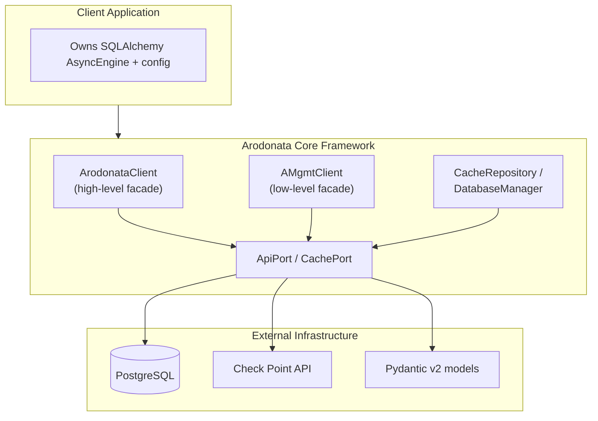

# Architecture Overview

Arodonata uses a **ports-and-adapters** (hexagonal) architecture: business
logic in `arodonata.core` and `arodonata.api` never imports a database driver or
an HTTP client directly — it depends on `Port` protocols
([`ApiPort`](../api/arodonata/ports/api_port.md),
[`CachePort`](../api/arodonata/ports/cache_port.md)), and concrete
`arodonata.adapters` implementations are wired in at construction time.

- **[Ports & Adapters](ports-and-adapters.md)** — the facade classes and how
  the port/adapter boundary is drawn.
- **[Caching & Sync](caching-and-sync.md)** — smart refresh, `show-changes`,
  and how the object cache stays fresh.
- **[Sessions & Multi-Domain](sessions-and-mdm.md)** — login/session
  lifecycle and MDM domain resolution.
