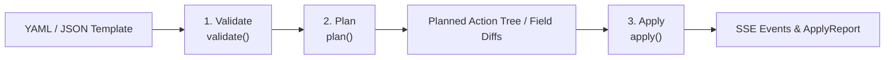

# CPCRUD — Idempotent Policy-as-Code Engine

The **CPCRUD** (Check Point Policy-as-Code CRUD) engine in `arodonata` provides declarative, conflict-aware, and idempotent object and rule operations across Check Point security management servers and multi-domain environments (MDM).

With `client.cpcrud`, you define desired security management state in YAML or JSON templates. The engine inspects live state, resolves conflicts, computes exact field-level diffs, and executes only the minimal required operations in dedicated session transactions.

---

## Key Features

- **Idempotent Execution**: Re-running the exact same template produces zero state mutations once applied (`outcome: unchanged` / `skipped`).
- **Plan-then-Execute Architecture**: Preview plan actions, field diffs, and potential conflicts before committing any changes.
- **Conflict Resolution Policies**: Configurable policies for handling name collisions (`on_name_conflict`) and IP address overlaps (`on_ip_conflict`).
- **Rulebase Aware**: Supports targeting rule layers (`layer`), packages (`package`), and positional anchoring (`position: top | bottom | above | below`).
- **Atomic Session Management**: Dedicated per-`(mgmt_name, domain_name)` write sessions with support for auto-publish, dry-runs, and instant transaction discarding.
- **Real-Time Streaming**: Asynchronous SSE (Server-Sent Events) streaming for fine-grained execution reporting.

---

## 3-Phase Lifecycle

The CPCRUD engine follows a structured three-phase pipeline:



### 1. Validation (`validate`)

Verifies template structure against `checkpoint_ops_schema.json` using `Draft7Validator`.

```python
errors = client.cpcrud.validate("path/to/template.yaml")
if errors:
    print("Schema errors found:", errors)
```

### 2. Planning (`plan`)

Queries live management state, evaluates conflict policies, diffs desired fields against existing objects, and produces a `Plan`.

```python
plan = await client.cpcrud.plan(
    "path/to/template.yaml",
    on_name_conflict="update",
    on_ip_conflict="reuse",
)
print(f"Actions to execute: {len(plan.actions)}")
for action in plan.actions:
    print(f"[{action.mgmt_name}:{action.domain_name}] {action.operation} {action.type} '{action.resolved_name}' -> {action.outcome.value}")
```

### 3. Execution (`apply`)

Opens dedicated write sessions, executes planned API commands, yields real-time `SSEEvent` items during execution, and returns an `ApplyReport`.

```python
async for event in client.cpcrud.apply("path/to/template.yaml"):
    if isinstance(event, ApplyReport):
        print("Final Summary:", event.summary)
    else:
        print(f"[{event.mgmt_name}:{event.domain}] {event.event_type}: {event.message}")
```

---

## Template Specification

Templates are written in YAML or JSON and structured hierarchically by Management Server, Domain, and Operation list.

### Basic Template Structure

```yaml
management_servers:
  - mgmt_name: "10.192.15.140"         # Target Management IP or Hostname
    domains:
      - name: "Domain4"                # Target Domain (or 'SMC' for single-domain)
        operations:
          - type: "host"
            data:
              name: "app-server-01"
              ip-address: "10.1.10.50"
              comments: "Production App Server"
              color: "dark green"
              groups: ["App-Servers"]
            on_name_conflict: "update" # 'update' (default) | 'error'
            on_ip_conflict: "reuse"    # 'reuse' (default) | 'create_new' | 'error'

          - type: "network"
            data:
              name: "Internal-Net"
              subnet: "10.1.0.0"
              mask-length: 16
              color: "blue"

          - type: "access-rule"
            layer: "Network"
            position: "bottom"
            data:
              name: "allow-app-access"
              source: ["app-server-01"]
              destination: ["any"]
              service: ["https", "http"]
              action: "accept"

          - type: "nat-rule"
            package: "Standard"
            position: "top"
            data:
              name: "app-server-nat"
              source: ["app-server-01"]
              destination: ["any"]
              service: ["any"]
              translated-source: "203.0.113.10"
              method: "hide"
```

---

## Supported Operation Types

| Operation Type | Key Data Fields | Description |
| :--- | :--- | :--- |
| `host` | `name`, `ip-address`, `comments`, `color`, `groups` | Check Point Host object |
| `network` | `name`, `subnet`, `mask-length` | Check Point Network object |
| `address-range` | `name`, `ip-address-first`, `ip-address-last` | Address range object |
| `network-group` | `name`, `members` | Host/network object group |
| `service-group` | `name`, `members` | Service object group |
| `tcp-service` | `name`, `port`, `comments` | TCP Service object |
| `udp-service` | `name`, `port`, `comments` | UDP Service object |
| `icmp-service` | `name`, `icmp-type`, `icmp-code` | ICMP Service object |
| `access-rule` | `name`, `source`, `destination`, `service`, `action` | Rule in Access Layer (requires `layer`) |
| `nat-rule` | `name`, `source`, `destination`, `translated-source`, etc. | NAT Rule (requires `package`) |
| `threat-prevention-rule` | `name`, `source`, `destination`, `service`, `action` | Threat Prevention rule (requires `layer`) |
| `https-rule` | `name`, `source`, `destination`, `service`, `action` | HTTPS Inspection rule (requires `layer`) |

Deletion isn't a separate `type` — set `operation: "delete"` on the object's
real `type` (e.g. `type: "host"`) with a `key` object instead of `data`
(e.g. `{"name": "..."}` or `{"uid": "..."}`).

---

## Conflict Resolution Policies

### Name Conflict Policy (`on_name_conflict`)

Controls behavior when an object with the same `name` already exists in the management server.

- **`update`** *(default)*: Compares desired fields with existing fields. If differences exist, issues an `update-*` API call (`outcome: update`). If fields match, skips execution (`outcome: unchanged`).
- **`error`**: Flagged as a conflict (`outcome: conflict`); execution aborts for that action.

### IP Conflict Policy (`on_ip_conflict`)

Controls behavior when another object shares the requested IP address or subnet.

- **`reuse`** *(default)*: Reuses the existing object matching the IP address (`outcome: reuse`).
- **`create_new`**: Creates a new object with auto-prefixed naming (e.g. `host_10.1.10.50`).
- **`error`**: Raises an IP conflict error and skips execution.

---

## Rule Positioning & Layer Targeting

For `access-rule` and `nat-rule` operations, CPCRUD supports explicit position placement relative to the whole layer, a specific section, or an existing rule.

```yaml
- type: "access-rule"
  layer: "Network"             # Target layer name
  position: "top"               # Top of the whole layer
  # or "bottom"                 # Bottom of the whole layer
  # or {top: "Section Name"}    # Top of a specific section (name or UID)
  # or {bottom: "Section Name"} # Bottom of a specific section
  # or {above: "rule-name-or-uid"}
  # or {below: "rule-name-or-uid"}
  # or a plain integer for an absolute 1-based rule number
  data:
    name: "sec-rule-01"
    source: ["any"]
    destination: ["any"]
    service: ["any"]
    action: "drop"
```

### Cleanup-rule-aware `bottom`

When you target `"bottom"` (whole layer) or `{bottom: "Section Name"}` (a section), CPCRUD checks the actual last rule in that scope first. If it has `source: Any`, `destination: Any`, **and** `service: Any` — regardless of its `action` or `name`, so this also catches an "accept any/any/any" rule, not just a "drop" cleanup rule — the new rule is inserted one position *above* it instead of literally at the bottom, so it never lands after an existing catch-all rule. If the last rule isn't a full any/any/any rule, `"bottom"` is used literally.

This cleanup-aware behavior applies to access/HTTPS/threat-prevention layers only. `nat-rule` positioning does not have it — NAT rulebases have no equivalent implicit cleanup rule — and section-relative positioning (`{top: ...}`/`{bottom: ...}`) is not supported for NAT rules at all; use `"top"`, `"bottom"`, an integer, or `{above: ...}`/`{below: ...}` instead.

---

## Execution Options & Session Handling

The `apply()` method accepts keyword arguments to fine-tune execution and transactional publishing:

```python
async for event in client.cpcrud.apply(
    template_path,
    dry_run=False,        # Preview mode without making live modifications
    force=False,          # Skip lock check warnings
    no_publish=False,     # Execute changes without publishing the session
    discard=False,        # Discard write session changes upon completion
    session_name="Deploy-App-Policy",
    session_description="Automated rollout via arodonata CPCRUD",
):
    ...
```

---

## Full Usage Example

```python
import asyncio
from pathlib import Path
from arodonata import ArodonataClient
from arodonata.cpcrud import ApplyReport

async def main():
    async with ArodonataClient(username="admin", password="password", mgmt_ip="10.192.15.140") as client:
        template_file = Path("crud_example.yaml")

        # 1. Validate
        errors = client.cpcrud.validate(template_file)
        if errors:
            print("Validation failed:", errors)
            return

        # 2. Plan
        plan = await client.cpcrud.plan(template_file)
        print(f"Generated plan with {len(plan.actions)} action(s):")
        for a in plan.actions:
            print(f"  - [{a.operation.upper()}] {a.type} '{a.resolved_name}' ({a.outcome.value})")

        # 3. Apply
        async for event in client.cpcrud.apply(plan):
            if isinstance(event, ApplyReport):
                print("Apply Complete Summary:", event.summary)

if __name__ == "__main__":
    asyncio.run(main())
```
